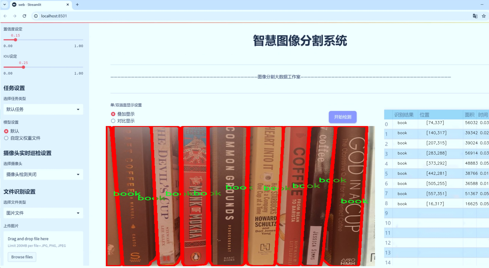
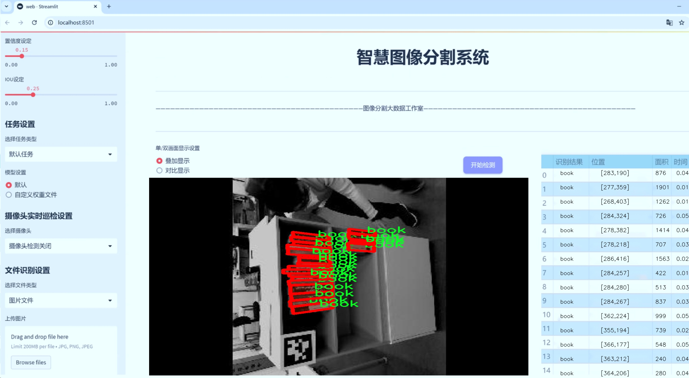
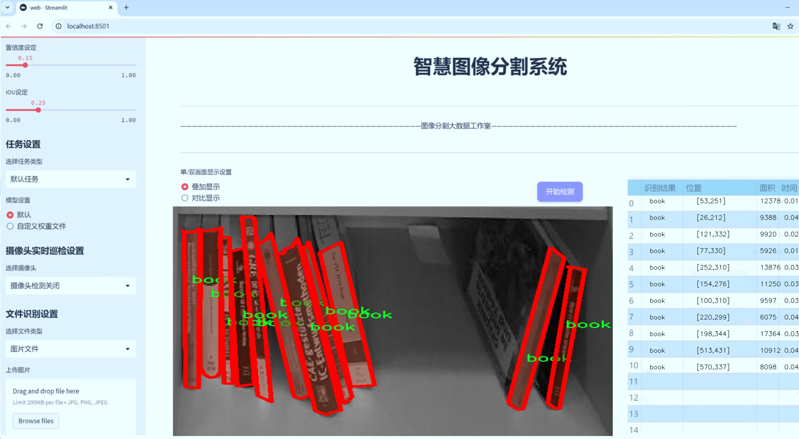
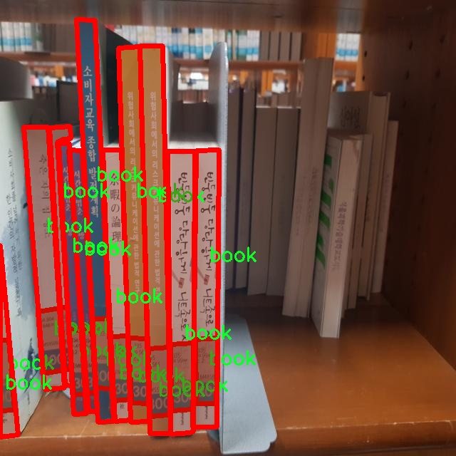
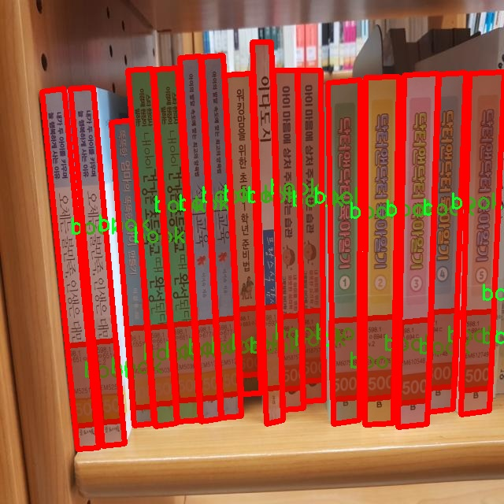
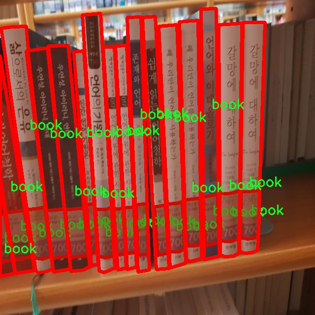
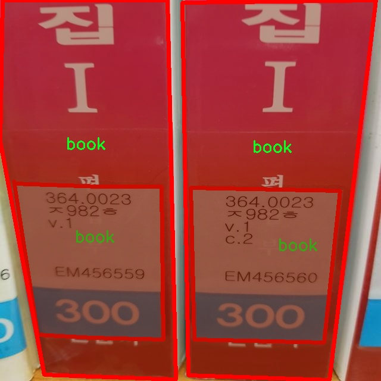
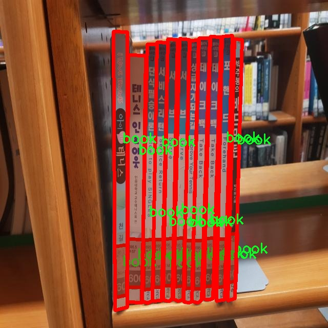

# 书籍图像分割系统： yolov8-seg-RepHGNetV2

### 1.研究背景与意义

[参考博客](https://gitee.com/YOLOv8_YOLOv11_Segmentation_Studio/projects)

[博客来源](https://kdocs.cn/l/cszuIiCKVNis)

研究背景与意义

随着信息技术的迅猛发展，数字化阅读逐渐成为人们获取知识的重要方式。然而，传统的纸质书籍在某些领域仍然占据着不可替代的地位，尤其是在学术研究、艺术欣赏和文化传承等方面。为了更好地管理和利用这些纸质书籍，图像处理技术的应用显得尤为重要。近年来，深度学习技术的快速发展为图像分割任务提供了强有力的工具，尤其是基于YOLO（You Only Look Once）系列模型的实例分割技术，因其高效性和准确性，逐渐成为图像分析领域的研究热点。

本研究旨在基于改进的YOLOv8模型，构建一个高效的书籍图像分割系统。该系统的核心目标是实现对书籍图像中书籍对象的精准分割，从而为后续的图像处理和分析提供基础。数据集方面，我们使用了包含2100张图像的“book-seg”数据集，该数据集专注于书籍这一单一类别，具有较高的针对性和实用性。通过对该数据集的深入分析与处理，我们可以有效地训练和优化YOLOv8模型，使其在书籍图像分割任务中表现出色。

在图像分割的研究中，实例分割技术尤为重要，它不仅能够识别图像中的物体，还能精确地分割出每个物体的轮廓。这对于书籍图像的处理具有重要意义，尤其是在图书馆、档案馆以及数字化图书管理系统中，准确的图像分割能够极大地提高书籍信息的提取效率和准确性。此外，随着图书馆数字化进程的加快，如何有效地管理和利用大量的书籍图像数据成为了一个亟待解决的问题。通过构建一个基于YOLOv8的书籍图像分割系统，我们可以为这一问题提供一种有效的解决方案。

本研究的意义不仅在于技术层面的创新，更在于其实际应用价值。通过实现对书籍图像的精准分割，我们能够为图书馆、出版社以及数字图书平台提供更为高效的图像处理工具。这将有助于提升书籍的数字化管理水平，促进知识的传播与共享。此外，改进YOLOv8模型的研究也将为实例分割领域的进一步发展提供新的思路和方法，推动相关技术的进步。

综上所述，基于改进YOLOv8的书籍图像分割系统的研究，不仅具有重要的学术价值，也具有广泛的应用前景。通过深入探索这一领域，我们期望能够为书籍图像的智能化处理提供新的解决方案，助力信息技术与传统文化的深度融合。

### 2.图片演示







注意：本项目提供完整的训练源码数据集和训练教程,由于此博客编辑较早,暂不提供权重文件（best.pt）,需要按照6.训练教程进行训练后实现上图效果。

### 3.视频演示

[3.1 视频演示](https://www.bilibili.com/video/BV1JpUUYAEBP/)

### 4.数据集信息

##### 4.1 数据集类别数＆类别名

nc: 1
names: ['book']


##### 4.2 数据集信息简介

数据集信息展示

在本研究中，我们使用了名为“book-seg”的数据集，旨在为改进YOLOv8-seg的书籍图像分割系统提供支持。该数据集专注于书籍这一特定类别，具有高度的针对性和实用性，能够有效提升模型在书籍图像分割任务中的表现。数据集的类别数量为1，类别列表中仅包含“book”这一项，表明该数据集专注于书籍的识别与分割，简化了模型的训练过程，使其能够集中学习与书籍相关的特征。

“book-seg”数据集的构建考虑到了书籍图像的多样性和复杂性，涵盖了不同类型、不同尺寸和不同背景的书籍图像。这些图像不仅包括封面展示，还可能包含书籍在不同环境下的实际应用场景，如书架、桌面或阅读场景等。这种多样性确保了模型在训练过程中能够接触到丰富的视觉信息，从而提高其在实际应用中的泛化能力。

在数据集的标注过程中，采用了精确的图像分割技术，对每一本书籍的边界进行了细致的标注。这种高质量的标注不仅为模型提供了清晰的学习目标，也为后续的评估和验证提供了可靠的依据。通过精确的分割，模型能够更好地理解书籍的形状、颜色和纹理等特征，从而在图像中准确识别和分割出书籍的区域。

此外，数据集的构建还考虑到了不同光照条件和拍摄角度对图像质量的影响。通过在多种环境下拍摄书籍图像，数据集能够涵盖各种可能的视觉场景。这种多样化的训练数据有助于模型在面对不同的实际应用场景时，依然能够保持良好的性能表现。无论是在明亮的阳光下，还是在昏暗的室内环境中，模型都能够有效地识别和分割出书籍的区域。

为了确保数据集的有效性和可靠性，我们在数据收集和标注过程中采取了严格的质量控制措施。每一张图像都经过仔细审核，确保其标注的准确性和一致性。这种高标准的质量控制不仅提升了数据集的整体质量，也为后续的模型训练和评估奠定了坚实的基础。

总之，“book-seg”数据集为改进YOLOv8-seg的书籍图像分割系统提供了一个高质量、针对性强的训练资源。通过对书籍这一单一类别的深入挖掘和多样化展示，该数据集不仅有助于提升模型的识别和分割能力，也为相关领域的研究提供了宝贵的数据支持。未来，我们期望通过进一步的研究和实验，探索更多的图像分割技术和方法，以实现更高效、更准确的书籍图像处理。











### 5.项目依赖环境部署教程（零基础手把手教学）

[5.1 环境部署教程链接（零基础手把手教学）](https://www.bilibili.com/video/BV1jG4Ve4E9t/?vd_source=bc9aec86d164b67a7004b996143742dc)


[5.2 安装Python虚拟环境创建和依赖库安装视频教程链接（零基础手把手教学）](https://www.bilibili.com/video/BV1nA4VeYEze/?vd_source=bc9aec86d164b67a7004b996143742dc)

### 6.手把手YOLOV8-seg训练视频教程（零基础手把手教学）

[6.1 手把手YOLOV8-seg训练视频教程（零基础小白有手就能学会）](https://www.bilibili.com/video/BV1cA4VeYETe/?vd_source=bc9aec86d164b67a7004b996143742dc)


按照上面的训练视频教程链接加载项目提供的数据集，运行train.py即可开始训练



     Epoch   gpu_mem       box       obj       cls    labels  img_size
     1/200     0G   0.01576   0.01955  0.007536        22      1280: 100%|██████████| 849/849 [14:42<00:00,  1.04s/it]
               Class     Images     Labels          P          R     mAP@.5 mAP@.5:.95: 100%|██████████| 213/213 [01:14<00:00,  2.87it/s]
                 all       3395      17314      0.994      0.957      0.0957      0.0843

     Epoch   gpu_mem       box       obj       cls    labels  img_size
     2/200     0G   0.01578   0.01923  0.007006        22      1280: 100%|██████████| 849/849 [14:44<00:00,  1.04s/it]
               Class     Images     Labels          P          R     mAP@.5 mAP@.5:.95: 100%|██████████| 213/213 [01:12<00:00,  2.95it/s]
                 all       3395      17314      0.996      0.956      0.0957      0.0845

     Epoch   gpu_mem       box       obj       cls    labels  img_size
     3/200     0G   0.01561    0.0191  0.006895        27      1280: 100%|██████████| 849/849 [10:56<00:00,  1.29it/s]
               Class     Images     Labels          P          R     mAP@.5 mAP@.5:.95: 100%|███████   | 187/213 [00:52<00:00,  4.04it/s]
                 all       3395      17314      0.996      0.957      0.0957      0.0845


### 7.50+种全套YOLOV8-seg创新点加载调参实验视频教程（一键加载写好的改进模型的配置文件）

[7.1 50+种全套YOLOV8-seg创新点加载调参实验视频教程（一键加载写好的改进模型的配置文件）](https://www.bilibili.com/video/BV1Hw4VePEXv/?vd_source=bc9aec86d164b67a7004b996143742dc)

### YOLOV8-seg算法简介

原始YOLOV8-seg算法原理

YOLOv8-seg算法是YOLO系列中的一个重要进展，结合了目标检测与语义分割的特性，旨在提升在复杂环境下对小目标的检测与分割能力。相较于传统的anchor-based检测方法，YOLOv8采用了anchor-free的策略，这一转变不仅提升了检测的精度，还显著加快了检测速度。这一算法的设计理念源于对实时性和准确性的双重追求，尤其是在水面等复杂背景下，YOLOv8-seg的应用显得尤为重要。

YOLOv8-seg的网络结构主要由四个模块组成：输入端、主干网络、Neck端和输出端。输入端负责对输入图像进行预处理，包括Mosaic数据增强、自适应图像缩放和灰度填充等操作。这些预处理步骤的目的是为了提高模型对不同场景和条件下的适应能力，确保输入数据的多样性和丰富性。接下来，主干网络通过一系列卷积和池化操作提取图像特征。YOLOv8-seg的主干网络采用了C2f模块和SPPF结构，这些结构的设计使得特征提取过程更加高效，能够在保持计算速度的同时，提取出更为细致的特征信息。

在Neck端，YOLOv8-seg采用了基于PAN（Path Aggregation Network）结构的设计，通过上采样、下采样和特征拼接等操作，实现了不同尺度特征图的融合。这一过程对于小目标的检测尤为重要，因为小目标往往在不同尺度下表现出不同的特征，Neck端的设计使得模型能够更好地捕捉到这些多尺度信息。输出端则采用了decoupled head结构，将分类和回归过程解耦，进而实现了更为精准的目标检测与分割。

YOLOv8-seg在损失函数的设计上也进行了创新，采用了MPDIoU（Multi-Point Distance Intersection over Union）损失函数替代了传统的CIoU（Complete Intersection over Union）损失函数。这一改进不仅提高了模型的泛化能力，还增强了其在复杂环境下的精准度。MPDIoU损失函数通过考虑多个关键点之间的距离关系，使得模型在处理小目标时，能够更好地进行定位与分割，从而减少了定位误差和漏检现象。

尽管YOLOv8-seg在设计上已经做出了诸多改进，但在实际应用中，仍然面临着一些挑战，尤其是在复杂水面环境下，小目标漂浮物的特征复杂且背景多样，这使得YOLOv8-seg在目标感知能力上仍存在不足。为了解决这些问题，YOLOv8-seg的改进版本——YOLOv8-WSSOD算法应运而生。该算法通过引入BiFormer双层路由注意力机制，构建了C2fBF模块，以减轻主干网络下采样过程中的噪声影响，保留了特征提取过程中更细粒度的上下文信息。

此外，YOLOv8-WSSOD还针对小目标漏检问题，添加了一个更小的检测头，以提升网络对小目标的感知力。同时，在Neck端引入GSConv和Slim-neck技术，进一步保持了模型的精度并降低了计算量。这些改进使得YOLOv8-WSSOD在处理复杂场景时，能够更有效地识别和分割小目标，从而提高了整体的检测性能。

总的来说，YOLOv8-seg算法通过一系列创新的设计和改进，极大地提升了目标检测与分割的能力，尤其是在复杂环境下的应用潜力。其独特的网络结构和损失函数设计，使得YOLOv8-seg在处理小目标时表现出色，尽管仍面临一些挑战，但其发展方向无疑为未来的研究提供了新的思路和方法。随着YOLOv8-seg及其改进版本的不断优化，预计在实际应用中将会取得更为显著的成果，为相关领域的研究与应用提供更为强大的技术支持。


### 9.系统功能展示（检测对象为举例，实际内容以本项目数据集为准）

图9.1.系统支持检测结果表格显示

  图9.2.系统支持置信度和IOU阈值手动调节

  图9.3.系统支持自定义加载权重文件best.pt(需要你通过步骤5中训练获得)

  图9.4.系统支持摄像头实时识别

  图9.5.系统支持图片识别

  图9.6.系统支持视频识别

  图9.7.系统支持识别结果文件自动保存

  图9.8.系统支持Excel导出检测结果数据


### 10.50+种全套YOLOV8-seg创新点原理讲解（非科班也可以轻松写刊发刊，V11版本正在科研待更新）

#### 10.1 由于篇幅限制，每个创新点的具体原理讲解就不一一展开，具体见下列网址中的创新点对应子项目的技术原理博客网址【Blog】：


[10.1 50+种全套YOLOV8-seg创新点原理讲解链接](https://gitee.com/qunmasj/good)

#### 10.2 部分改进模块原理讲解(完整的改进原理见上图和技术博客链接)【如果此小节的图加载失败可以通过CSDN或者Github搜索该博客的标题访问原始博客，原始博客图片显示正常】
### YOLOv8简介

YOLOv8是一种最新的SOTA算法，提供了N/S/M/L/X尺度的不同大小模型，以满足不同场景的需求。本章对算法网络的新特性进行简要介绍。


1）骨干网络和Neck
开发者设计了C2f模块对CSPDarkNet 53和PAFPN进行改造。相比C3模块，C2f模块拥有更多的分支跨层链接，使模型的梯度流更加丰富，显著增强了模型的特征提取能力。
2)Head部分
Head部分采用无锚框设计，将分类任务和回归任务进行了解耦，独立的分支将更加专注于其所负责的特征信息。
3）损失计算
模型使用CIOU Loss作为误差损失函数，并通过最小化DFL进一步提升边界框的回归精度。同时模型采用了TaskAlignedAssigner样本分配策略，以分类得分和IOU的高阶组合作为指标指导正负样本选择，实现了高分类得分和高IOU的对齐，有效地提升了模型的检测精度。


### D-LKA Attention简介
自2010年代中期以来，卷积神经网络（CNNs）已成为许多计算机视觉应用的首选技术。它们能够从原始数据中自动提取复杂的特征表示，无需手动进行特征工程，这引起了医学图像分析社区的极大兴趣。许多成功的CNN架构，如U-Net、全卷积网络、DeepLab或SegCaps（分割胶囊），已经被开发出来。这些架构在语义分割任务中取得了巨大成功，先前的最新方法已经被超越。

在计算机视觉研究中，不同尺度下的目标识别是一个关键问题。在CNN中，可检测目标的大小与相应网络层的感受野尺寸密切相关。如果一个目标扩展到超出这个感受野的边界，这可能会导致欠分割结果。相反，与目标实际大小相比使用过大的感受野可能会限制识别，因为背景信息可能会对预测产生不必要的影响。

解决这个问题的一个有希望的方法涉及在并行使用具有不同尺寸的多个Kernel，类似于Inception块的机制。然而，由于参数和计算要求的指数增长，将Kernel大小增加以容纳更大的目标在实践中受到限制。因此，出现了各种策略，包括金字塔池化技术和不同尺度的扩张卷积，以捕获多尺度的上下文信息。

另一个直观的概念涉及将多尺度图像金字塔或它们的相关特征表示直接纳入网络架构。然而，这种方法存在挑战，特别是在管理训练和推理时间方面的可行性方面存在挑战。在这个背景下，使用编码器-解码器网络，如U-Net，已被证明是有利的。这样的网络在较浅的层中编码外观和位置，而在更深的层中，通过神经元的更广泛的感受野捕获更高的语义信息和上下文信息。

一些方法将来自不同层的特征组合在一起，或者预测来自不同尺寸的层的特征以使用多尺度的信息。此外，出现了从不同尺度的层中预测特征的方法，有效地实现了跨多个尺度的见解整合。然而，大多数编码器-解码器结构面临一个挑战：它们经常无法在不同尺度之间保持一致的特征，并主要使用最后一个解码器层生成分割结果。

语义分割是一项任务，涉及根据预定义的标签集为图像中的每个像素预测语义类别。这项任务要求提取高级特征同时保留初始的空间分辨率。CNNs非常适合捕获局部细节和低级信息，尽管以忽略全局上下文为代价。视觉Transformer（ViT）架构已经成为解决处理全局信息的视觉任务的关键，包括语义分割，取得了显著的成功。

ViT的基础是注意力机制，它有助于在整个输入序列上聚合信息。这种能力使网络能够合并远程的上下文提示，超越了CNN的有限感受野尺寸。然而，这种策略通常会限制ViT有效建模局部信息的能力。这种局限可能会妨碍它们检测局部纹理的能力，这对于各种诊断和预测任务至关重要。这种缺乏局部表示可以归因于ViT模型处理图像的特定方式。

ViT模型将图像分成一系列Patch，并使用自注意力机制来模拟它们之间的依赖关系。这种方法可能不如CNN模型中的卷积操作对感受野内提取局部特征有效。ViT和CNN模型之间的这种图像处理方法的差异可能解释了CNN模型在局部特征提取方面表现出色的原因。

近年来，已经开发出创新性方法来解决Transformer模型内部局部纹理不足的问题。其中一种方法是通过互补方法将CNN和ViT特征结合起来，以结合它们的优势并减轻局部表示的不足。TransUNet是这种方法的早期示例，它在CNN的瓶颈中集成了Transformer层，以模拟局部和全局依赖关系。HiFormer提出了一种解决方案，将Swin Transformer模块和基于CNN的编码器结合起来，生成两个多尺度特征表示，通过Double-Level Fusion模块集成。UNETR使用基于Transformer的编码器和CNN解码器进行3D医学图像分割。CoTr和TransBTS通过Transformer在低分辨率阶段增强分割性能，将CNN编码器和解码器连接在一起。

增强局部特征表示的另一种策略是重新设计纯Transformer模型内部的自注意力机制。在这方面，Swin-Unet在U形结构中集成了一个具有线性计算复杂性的Swin Transformer块作为多尺度 Backbone 。MISSFormer采用高效Transformer来解决视觉Transformer中的参数问题，通过在输入块上进行不可逆的降采样操作。D-Former引入了一个纯Transformer的管道，具有双重注意模块，以分段的方式捕获细粒度的局部注意和与多元单元的交互。然而，仍然存在一些特定的限制，包括计算效率低下，如TransUNet模型所示，对CNN Backbone 的严重依赖，如HiFormer所观察到的，以及对多尺度信息的忽略。

此外，目前的分割架构通常采用逐层处理3D输入 volumetric 的方法，无意中忽视了相邻切片之间的潜在相关性。这一疏忽限制了对 volumetric 信息的全面利用，因此损害了定位精度和上下文集成。此外，必须认识到，医学领域的病变通常在形状上发生变形。因此，用于医学图像分析的任何学习算法都必须具备捕捉和理解这些变形的能力。与此同时，该算法应保持计算效率，以便处理3D volumetric数据。

为了解决上述提到的挑战，作者提出了一个解决方案，即可变形大卷积核注意力模块（Deformable LKA module），它是作者网络设计的基本构建模块。这个模块明确设计成在有效处理上下文信息的同时保留局部描述符。作者的架构在这两个方面的平衡增强了实现精确语义分割的能力。

值得注意的是，参考该博客引入了一种基于数据的感受野的动态适应，不同于传统卷积操作中的固定滤波器Mask。这种自适应方法使作者能够克服与静态方法相关的固有限制。这种创新方法还扩展到了D-LKA Net架构的2D和3D版本的开发。

在3D模型的情况下，D-LKA机制被量身定制以适应3D环境，从而实现在不同 volumetric 切片之间无缝信息交互。最后，作者的贡献通过其计算效率得到进一步强调。作者通过仅依靠D-LKA概念的设计来实现这一点，在各种分割基准上取得了显著的性能，确立了作者的方法作为一种新的SOTA方法。

在本节中，作者首先概述方法论。首先，作者回顾了由Guo等人引入的大卷积核注意力（Large Kernel Attention，LKA）的概念。然后，作者介绍了作者对可变形LKA模块的创新探索。在此基础上，作者介绍了用于分割任务的2D和3D网络架构。

大卷积核提供了与自注意力机制类似的感受野。可以通过使用深度卷积、深度可扩展卷积和卷积来构建大卷积核，从而减少了参数和计算量。构建输入维度为和通道数的卷积核的深度卷积和深度可扩展卷积的卷积核大小的方程如下：


具有卷积核大小和膨胀率。参数数量和浮点运算（FLOPs）的计算如下：


FLOPs的数量与输入图像的大小成线性增长。参数的数量随通道数和卷积核大小的增加而呈二次增长。然而，由于它们通常都很小，因此它们不是限制因素。

为了最小化对于固定卷积核大小K的参数数量，可以将方程3对于膨胀率的导数设定为零：


例如，当卷积核大小为时，结果是。将这些公式扩展到3D情况是直接的。对于大小为和通道数C的输入，3D情况下参数数量和FLOPs 的方程如下：


具有卷积核大小和膨胀。


利用大卷积核进行医学图像分割的概念通过引入可变形卷积得以扩展。可变形卷积可以通过整数偏移自由调整采样网格以进行自由变形。额外的卷积层从特征图中学习出变形，从而创建一个偏移场。基于特征本身学习变形会导致自适应卷积核。这种灵活的卷积核形状可以提高病变或器官变形的表示，从而增强了目标边界的定义。

负责计算偏移的卷积层遵循其相应卷积层的卷积核大小和膨胀。双线性插值用于计算不在图像网格上的偏移的像素值。如图2所示，D-LKA模块可以表示为：


其中输入特征由表示，。表示为注意力图，其中每个值表示相应特征的相对重要性。运算符  表示逐元素乘法运算。值得注意的是，LKA不同于传统的注意力方法，它不需要额外的规范化函数，如或。这些规范化函数往往忽视高频信息，从而降低了基于自注意力的方法的性能。

在该方法的2D版本中，卷积层被可变形卷积所替代，因为可变形卷积能够改善对具有不规则形状和大小的目标的捕捉能力。这些目标在医学图像数据中常常出现，因此这种增强尤为重要。

然而，将可变形LKA的概念扩展到3D领域会带来一定的挑战。主要的约束来自于需要用于生成偏移的额外卷积层。与2D情况不同，由于输入和输出通道的性质，这一层无法以深度可分的方式执行。在3D环境中，输入通道对应于特征，而输出通道扩展到，其中是卷积核的大小。大卷积核的复杂性导致沿第3D的通道数扩展，导致参数和FLOPs大幅增加。因此，针对3D情况采用了另一种替代方法。在现有的LKA框架中，深度卷积之后引入了一个单独的可变形卷积层。这种战略性的设计调整旨在减轻扩展到3D领域所带来的挑战。


2D网络的架构如图1所示。第一变种使用MaxViT作为编码器组件，用于高效特征提取，而第二变种则结合可变形LKA层进行更精细、卓越的分割。

在更正式的描述中，编码器生成4个分层输出表示。首先，卷积干扰将输入图像的维度减小到。随后，通过4个MaxViT块的4个阶段进行特征提取，每个阶段后跟随降采样层。随着过程进展到解码器，实施了4个阶段的D-LKA层，每个阶段包含2个D-LKA块。然后，应用Patch扩展层以实现分辨率上采样，同时减小通道维度。最后，线性层负责生成最终的输出。

2D D-LKA块的结构包括LayerNorm、可变形LKA和多层感知器（MLP）。积分残差连接确保了有效的特征传播，即使在更深层也是如此。这个安排可以用数学方式表示为：


其中输入特征，层归一化LN，可变形LKA注意力，深度卷积，线性层和GeLU激活函数。

3D网络架构如图1所示，采用编码器-解码器设计进行分层结构化。首先，一个Patch嵌入层将输入图像的维度从（）减小到（）。在编码器中，采用了3个D-LKA阶段的序列，每个阶段包含3个D-LKA块。在每个阶段之后，通过降采样步骤将空间分辨率减半，同时将通道维度加倍。中央瓶颈包括另一组2个D-LKA块。解码器结构与编码器相对称。

为了将特征分辨率加倍，同时减少通道数，使用转置卷积。每个解码器阶段都使用3个D-LKA块来促进远距离特征依赖性。最终的分割输出由一个卷积层产生，后面跟随一个卷积层以匹配特定类别的通道要求。

为了建立输入图像和分割输出之间的直接连接，使用卷积形成了一个跳跃连接。额外的跳跃连接根据简单的加法对来自其他阶段的特征进行融合。最终的分割图是通过和卷积层的组合产生的。

3D D-LKA块包括层归一化，后跟D-LKA注意力，应用了残差连接的部分。随后的部分采用了一个卷积层，后面跟随一个卷积层，两者都伴随着残差连接。这个整个过程可以总结如下：


带有输入特征 、层归一化 、可变形 LKA 、卷积层 和输出特征 的公式。是指一个前馈网络，包括2个卷积层和激活函数。

表7显示了普通卷积和构建卷积的参数数量比较。尽管标准卷积的参数数量在通道数较多时急剧增加，但分解卷积的参数总体较低，并且增长速度不那么快。

与分解卷积相比，可变形分解卷积增加了大量参数，但仍然明显小于标准卷积。可变形卷积的主要参数是由偏移网络创建的。在这里，作者假设可变形深度卷积的Kernel大小为（5,5），可变形深度空洞卷积的Kernel大小为（7,7）。这导致了21×21大小的大Kernel的最佳参数数量。更高效地生成偏移量的方法将大大减少参数数量。


值得注意的是，引入可变形LKA确实会增加模型的参数数量和每秒的浮点运算次数（FLOPS）。然而，重要的是强调，这增加的计算负载不会影响作者模型的整体推理速度。

相反，对于Batch-size > 1，作者甚至观察到推理时间的减少，如图7所示。例如，基于作者的广泛实验，作者观察到对于Batch-size为16，具有可变形卷积和没有可变形卷积的推理时间分别为8.01毫秒和17.38毫秒。作者认为这是由于在2D中对可变形卷积的高效实现所致。为了测量时间，使用了大小为（）的随机输入。在GPU热身周期50次迭代之后，网络被推断了1000次。测量是在NVIDIA RTX 3090 GPU上进行的。


为了充分利用性能与参数之间的权衡关系，作者在图8中可视化了在Synapse 2D数据集上报告的DSC和HD性能以及基于参数数量的内存消耗。D-LKA Net引入了相当多的参数，约为101M。这比性能第二好的方法ScaleFormer使用的111.6M参数要少。

与更轻量级的DAEFormer模型相比，作者实现了更好的性能，这证明了参数增加的合理性。大多数参数来自于MaxViT编码器；因此，将编码器替换为更高效的编码器可以减少模型参数。值得注意的是，在此可视化中，作者最初将HD和内存值都归一化到[0, 100]范围内。随后，作者将它们从100缩小，以增强更高值的表示。


### 11.项目核心源码讲解（再也不用担心看不懂代码逻辑）

#### 11.1 ultralytics\cfg\__init__.py

以下是经过简化和注释的核心代码部分，保留了最重要的功能和逻辑。

```python
# 导入必要的库和模块
import sys
from pathlib import Path
from typing import Dict, Union
from ultralytics.utils import yaml_load, LOGGER, DEFAULT_CFG_DICT

# 定义有效的任务和模式
MODES = 'train', 'val', 'predict', 'export', 'track', 'benchmark'
TASKS = 'detect', 'segment', 'classify', 'pose'

def cfg2dict(cfg):
    """
    将配置对象转换为字典格式。
    
    参数:
        cfg (str | Path | dict): 配置对象，可以是文件路径、字符串或字典。
    
    返回:
        dict: 转换后的字典格式配置。
    """
    if isinstance(cfg, (str, Path)):
        cfg = yaml_load(cfg)  # 从文件加载字典
    return cfg

def get_cfg(cfg: Union[str, Dict] = DEFAULT_CFG_DICT, overrides: Dict = None):
    """
    加载并合并配置数据。
    
    参数:
        cfg (str | dict): 配置数据。
        overrides (dict | optional): 覆盖的配置字典，默认为None。
    
    返回:
        SimpleNamespace: 训练参数的命名空间。
    """
    cfg = cfg2dict(cfg)  # 将配置转换为字典

    # 合并覆盖的配置
    if overrides:
        overrides = cfg2dict(overrides)
        cfg = {**cfg, **overrides}  # 合并配置字典

    # 返回配置的命名空间
    return SimpleNamespace(**cfg)

def entrypoint(debug=''):
    """
    程序的入口点，负责解析命令行参数并执行相应的操作。
    
    参数:
        debug (str): 调试模式下的参数。
    """
    args = (debug.split(' ') if debug else sys.argv)[1:]  # 获取命令行参数
    if not args:  # 如果没有参数
        LOGGER.info("No arguments provided.")
        return

    overrides = {}  # 存储覆盖的配置
    for a in args:
        if '=' in a:  # 处理形如 'key=value' 的参数
            k, v = a.split('=', 1)
            overrides[k] = v  # 存储覆盖的配置
        elif a in TASKS:
            overrides['task'] = a  # 存储任务类型
        elif a in MODES:
            overrides['mode'] = a  # 存储模式

    # 加载配置
    cfg = get_cfg(overrides=overrides)  # 获取最终的配置

    # 执行相应的任务
    if cfg.mode == 'train':
        # 训练模型的逻辑
        pass
    elif cfg.mode == 'predict':
        # 预测的逻辑
        pass
    # 其他模式的处理...

if __name__ == '__main__':
    entrypoint()  # 调用入口函数
```

### 代码说明
1. **导入模块**：导入了必要的库和工具，包括文件路径处理、类型注解和Ultralytics库中的工具。
2. **配置转换**：`cfg2dict`函数将配置对象（可以是字符串、路径或字典）转换为字典格式，方便后续处理。
3. **获取配置**：`get_cfg`函数加载并合并配置数据，支持从文件或字典中读取配置，并可以应用覆盖的配置。
4. **入口函数**：`entrypoint`函数是程序的主入口，负责解析命令行参数并根据模式执行相应的操作（如训练、预测等）。
5. **参数处理**：在`entrypoint`中，处理命令行参数，识别任务和模式，并将它们存储在覆盖字典中。

这个简化的版本保留了核心逻辑，去掉了不必要的细节和冗余部分，使得代码更加清晰易懂。

这个文件是Ultralytics YOLO（You Only Look Once）项目的配置初始化文件，主要用于处理命令行参数、配置文件的加载和合并、以及提供一些辅助功能以支持YOLO模型的训练、验证、预测等操作。

首先，文件导入了一些必要的库和模块，包括用于文件路径处理的`Path`、用于类型检查的`SimpleNamespace`和一些Ultralytics特有的工具函数和常量。接着，定义了一些有效的任务和模式，例如训练（train）、验证（val）、预测（predict）、导出（export）、跟踪（track）和基准测试（benchmark），以及对应的任务类型如检测（detect）、分割（segment）、分类（classify）和姿态估计（pose）。

文件中还定义了一些任务与数据集、模型和评价指标之间的映射关系，例如检测任务对应的模型是`yolov8n.pt`，评价指标是`metrics/mAP50-95(B)`等。这些映射关系有助于在不同任务之间进行快速切换和配置。

接下来，文件提供了一个命令行帮助信息（`CLI_HELP_MSG`），用于指导用户如何使用YOLO命令行工具。用户可以通过不同的命令来训练模型、进行预测、验证模型等操作。

文件中还定义了一些用于配置参数类型检查的常量，例如浮点数、整数和布尔值的键名。这些常量用于后续的配置验证，以确保用户输入的参数类型正确。

`cfg2dict`函数用于将配置对象转换为字典格式，支持文件路径、字符串、字典和`SimpleNamespace`对象。`get_cfg`函数则用于加载和合并配置数据，并进行类型和值的检查，确保用户的输入符合预期。

`get_save_dir`函数根据用户的输入参数生成保存目录，确保训练或预测结果能够被正确保存。`_handle_deprecation`函数用于处理过时的配置键，确保用户的旧配置能够向新配置平滑过渡。

`check_dict_alignment`函数用于检查自定义配置与基础配置之间的键是否匹配，若发现不匹配的键，则会给出提示并退出程序。`merge_equals_args`函数用于合并命令行参数中的等号分隔的键值对。

`handle_yolo_hub`和`handle_yolo_settings`函数分别处理与Ultralytics HUB和YOLO设置相关的命令行操作，提供用户登录、登出和设置重置等功能。

`entrypoint`函数是程序的入口点，负责解析命令行参数并根据用户的输入执行相应的操作。它会检查输入的任务和模式，加载相应的模型，并调用模型的相应方法进行训练、验证或预测等操作。

最后，文件中提供了一个`copy_default_cfg`函数，用于复制默认配置文件，以便用户可以在此基础上进行自定义修改。

整体而言，这个文件是Ultralytics YOLO项目的核心配置管理模块，提供了灵活的命令行接口和强大的配置管理功能，使得用户能够方便地使用YOLO模型进行各种计算机视觉任务。

#### 11.2 ultralytics\nn\extra_modules\kernel_warehouse.py

以下是代码中最核心的部分，并附上详细的中文注释：

```python
import torch
import torch.nn as nn
import torch.nn.functional as F

class Attention(nn.Module):
    def __init__(self, in_planes, reduction, num_static_cell, num_local_mixture, norm_layer=nn.BatchNorm1d,
                 cell_num_ratio=1.0, nonlocal_basis_ratio=1.0, start_cell_idx=None):
        super(Attention, self).__init__()
        # 计算隐藏层的通道数
        hidden_planes = max(int(in_planes * reduction), 16)
        self.kw_planes_per_mixture = num_static_cell + 1  # 每个混合物的通道数
        self.num_local_mixture = num_local_mixture  # 本地混合物的数量
        self.kw_planes = self.kw_planes_per_mixture * num_local_mixture  # 总的通道数

        # 计算本地和非本地单元的数量
        self.num_local_cell = int(cell_num_ratio * num_local_mixture)
        self.num_nonlocal_cell = num_static_cell - self.num_local_cell
        self.start_cell_idx = start_cell_idx

        # 定义层
        self.avgpool = nn.AdaptiveAvgPool1d(1)  # 自适应平均池化
        self.fc1 = nn.Linear(in_planes, hidden_planes, bias=(norm_layer is not nn.BatchNorm1d))  # 全连接层
        self.norm1 = norm_layer(hidden_planes)  # 归一化层
        self.act1 = nn.ReLU(inplace=True)  # 激活函数

        # 根据非本地基数比率选择映射方式
        if nonlocal_basis_ratio >= 1.0:
            self.map_to_cell = nn.Identity()  # 直接映射
            self.fc2 = nn.Linear(hidden_planes, self.kw_planes, bias=True)  # 第二个全连接层
        else:
            self.map_to_cell = self.map_to_cell_basis  # 使用基数映射
            self.num_basis = max(int(self.num_nonlocal_cell * nonlocal_basis_ratio), 16)  # 基数数量
            self.fc2 = nn.Linear(hidden_planes, (self.num_local_cell + self.num_basis + 1) * num_local_mixture, bias=False)
            self.fc3 = nn.Linear(self.num_basis, self.num_nonlocal_cell, bias=False)  # 用于非本地映射的全连接层
            self.basis_bias = nn.Parameter(torch.zeros([self.kw_planes]), requires_grad=True).float()  # 基数偏置

        self.temp_bias = torch.zeros([self.kw_planes], requires_grad=False).float()  # 温度偏置
        self.temp_value = 0  # 温度值
        self._initialize_weights()  # 初始化权重

    def _initialize_weights(self):
        # 初始化网络权重
        for m in self.modules():
            if isinstance(m, nn.Linear):
                nn.init.kaiming_normal_(m.weight, mode='fan_out', nonlinearity='relu')  # Kaiming初始化
                if m.bias is not None:
                    nn.init.constant_(m.bias, 0)  # 偏置初始化为0
            if isinstance(m, nn.BatchNorm1d):
                nn.init.constant_(m.weight, 1)  # 批归一化权重初始化为1
                nn.init.constant_(m.bias, 0)  # 偏置初始化为0

    def forward(self, x):
        # 前向传播
        x = self.avgpool(x.reshape(*x.shape[:2], -1)).squeeze(dim=-1)  # 自适应池化
        x = self.act1(self.norm1(self.fc1(x)))  # 经过全连接层、归一化和激活函数
        x = self.map_to_cell(self.fc2(x)).reshape(-1, self.kw_planes)  # 映射到单元
        x = x / (torch.sum(torch.abs(x), dim=1).view(-1, 1) + 1e-3)  # 归一化
        x = (1.0 - self.temp_value) * x.reshape(-1, self.kw_planes) + self.temp_value * self.temp_bias.to(x.device).view(1, -1)  # 温度调整
        return x.reshape(-1, self.kw_planes_per_mixture)[:, :-1]  # 返回结果

class KWconvNd(nn.Module):
    def __init__(self, in_planes, out_planes, kernel_size, stride=1, padding=0, dilation=1, groups=1,
                 bias=False, warehouse_id=None, warehouse_manager=None):
        super(KWconvNd, self).__init__()
        # 初始化卷积层参数
        self.in_planes = in_planes  # 输入通道数
        self.out_planes = out_planes  # 输出通道数
        self.kernel_size = kernel_size  # 卷积核大小
        self.stride = stride  # 步幅
        self.padding = padding  # 填充
        self.dilation = dilation  # 膨胀
        self.groups = groups  # 分组卷积
        self.bias = nn.Parameter(torch.zeros([self.out_planes]), requires_grad=True).float() if bias else None  # 偏置
        self.warehouse_id = warehouse_id  # 仓库ID
        self.warehouse_manager = [warehouse_manager]  # 仓库管理器

    def forward(self, x):
        # 前向传播
        kw_attention = self.attention(x).type(x.dtype)  # 获取注意力权重
        batch_size = x.shape[0]  # 批大小
        x = x.reshape(1, -1, *x.shape[2:])  # 重塑输入
        weight = self.warehouse_manager[0].take_cell(self.warehouse_id).reshape(self.cell_shape[0], -1).type(x.dtype)  # 获取权重
        aggregate_weight = torch.mm(kw_attention, weight)  # 加权
        aggregate_weight = aggregate_weight.reshape([batch_size, self.groups_spatial, self.groups_out_channel,
                                                     self.groups_in_channel, *self.cell_shape[1:]])  # 重塑加权
        output = self.func_conv(x, weight=aggregate_weight, bias=None, stride=self.stride, padding=self.padding,
                                dilation=self.dilation, groups=self.groups * batch_size)  # 卷积操作
        output = output.view(batch_size, self.out_planes, *output.shape[2:])  # 重塑输出
        if self.bias is not None:
            output = output + self.bias.reshape(1, -1, *([1]*self.dimension))  # 添加偏置
        return output  # 返回输出
```

### 代码核心部分说明：
1. **Attention类**：实现了一个注意力机制，用于动态调整卷积层的权重。通过自适应池化、全连接层和激活函数来计算注意力权重，并进行温度调整。

2. **KWconvNd类**：是一个通用的卷积层类，支持多维卷积。它利用注意力机制和仓库管理器来动态获取卷积权重，并进行卷积操作。

3. **前向传播**：在`forward`方法中，首先通过注意力机制计算权重，然后进行卷积操作，最后返回输出结果。

这些核心部分构成了该代码的主要功能，旨在通过注意力机制和动态权重管理来提高卷积神经网络的性能。

这个程序文件主要实现了一个名为“Kernel Warehouse”的模块，旨在通过动态管理卷积核来提高深度学习模型的效率和灵活性。代码中定义了多个类和函数，下面对其进行逐一说明。

首先，文件引入了必要的PyTorch库，包括`torch`、`torch.nn`和`torch.nn.functional`等，此外还引入了一些工具函数和模块。`__all__`定义了模块的公共接口，包含`KWConv`和`Warehouse_Manager`。

接下来，定义了一个`parse`函数，用于处理输入参数，确保输入是可迭代的，并根据需要返回重复的值或直接返回原值。

`Attention`类是核心组件之一，负责实现注意力机制。它的构造函数接受多个参数，包括输入通道数、降维比例、静态单元数量、局部混合数量等。类中定义了多个层，包括线性层和归一化层，并实现了权重初始化、温度更新和映射到单元的功能。`forward`方法实现了前向传播，通过平均池化、线性变换和注意力机制生成输出。

`KWconvNd`类是一个通用的卷积层类，继承自`nn.Module`。它的构造函数接受卷积参数，并根据维度解析它们。`init_attention`方法用于初始化注意力机制，而`forward`方法则实现了卷积操作，结合了从仓库中获取的权重。

接下来，`KWConv1d`、`KWConv2d`和`KWConv3d`分别实现了一维、二维和三维卷积，指定了维度和相应的卷积函数。

`KWLinear`类则实现了线性层，内部使用`KWConv1d`进行计算。

`Warehouse_Manager`类是管理卷积核仓库的主要类。它的构造函数接受多个参数，用于配置仓库的行为。`reserve`方法用于创建动态卷积层并记录其信息，`store`方法用于存储卷积核的权重，`allocate`方法则分配权重并初始化。

`KWConv`类是一个封装类，结合了卷积层、批归一化和激活函数，简化了使用过程。

最后，`get_temperature`函数用于计算温度值，这在训练过程中可能用于调整模型的学习策略。

整体来看，这个文件实现了一个灵活的卷积核管理系统，通过动态分配和调整卷积核，旨在提高模型的性能和适应性。

#### 11.3 ultralytics\utils\atss.py

以下是经过简化和注释的核心代码部分，主要集中在生成锚框和计算IoU的功能上：

```python
import torch
import torch.nn as nn
import torch.nn.functional as F

def generate_anchors(feats, fpn_strides, grid_cell_size=5.0, grid_cell_offset=0.5, device='cpu', is_eval=False, mode='af'):
    '''根据特征生成锚框。'''
    anchors = []  # 存储锚框
    anchor_points = []  # 存储锚点
    stride_tensor = []  # 存储步幅
    num_anchors_list = []  # 存储每层锚框数量

    assert feats is not None  # 确保特征不为空

    # 如果是评估模式
    if is_eval:
        for i, stride in enumerate(fpn_strides):
            _, _, h, w = feats[i].shape  # 获取特征图的高度和宽度
            shift_x = torch.arange(end=w, device=device) + grid_cell_offset  # 计算x方向的偏移
            shift_y = torch.arange(end=h, device=device) + grid_cell_offset  # 计算y方向的偏移
            shift_y, shift_x = torch.meshgrid(shift_y, shift_x, indexing='ij')  # 创建网格
            anchor_point = torch.stack([shift_x, shift_y], axis=-1).to(torch.float)  # 生成锚点

            if mode == 'af':  # anchor-free模式
                anchor_points.append(anchor_point.reshape([-1, 2]))  # 将锚点展平
                stride_tensor.append(torch.full((h * w, 1), stride, dtype=torch.float, device=device))  # 生成步幅张量
            elif mode == 'ab':  # anchor-based模式
                anchor_points.append(anchor_point.reshape([-1, 2]).repeat(3, 1))  # 重复锚点
                stride_tensor.append(torch.full((h * w, 1), stride, dtype=torch.float, device=device).repeat(3, 1))  # 重复步幅张量

        anchor_points = torch.cat(anchor_points)  # 合并所有锚点
        stride_tensor = torch.cat(stride_tensor)  # 合并所有步幅
        return anchor_points, stride_tensor  # 返回锚点和步幅

    # 非评估模式
    else:
        for i, stride in enumerate(fpn_strides):
            _, _, h, w = feats[i].shape  # 获取特征图的高度和宽度
            cell_half_size = grid_cell_size * stride * 0.5  # 计算锚框的一半大小
            shift_x = (torch.arange(end=w, device=device) + grid_cell_offset) * stride  # 计算x方向的偏移
            shift_y = (torch.arange(end=h, device=device) + grid_cell_offset) * stride  # 计算y方向的偏移
            shift_y, shift_x = torch.meshgrid(shift_y, shift_x, indexing='ij')  # 创建网格

            # 生成锚框的坐标
            anchor = torch.stack([
                shift_x - cell_half_size, shift_y - cell_half_size,
                shift_x + cell_half_size, shift_y + cell_half_size
            ], axis=-1).clone().to(feats[0].dtype)

            anchor_point = torch.stack([shift_x, shift_y], axis=-1).clone().to(feats[0].dtype)  # 生成锚点

            if mode == 'af':  # anchor-free模式
                anchors.append(anchor.reshape([-1, 4]))  # 将锚框展平
                anchor_points.append(anchor_point.reshape([-1, 2]))  # 将锚点展平
            elif mode == 'ab':  # anchor-based模式
                anchors.append(anchor.reshape([-1, 4]).repeat(3, 1))  # 重复锚框
                anchor_points.append(anchor_point.reshape([-1, 2]).repeat(3, 1))  # 重复锚点

            num_anchors_list.append(len(anchors[-1]))  # 记录当前层的锚框数量
            stride_tensor.append(torch.full([num_anchors_list[-1], 1], stride, dtype=feats[0].dtype))  # 生成步幅张量

        anchors = torch.cat(anchors)  # 合并所有锚框
        anchor_points = torch.cat(anchor_points).to(device)  # 合并所有锚点并转移到指定设备
        stride_tensor = torch.cat(stride_tensor).to(device)  # 合并所有步幅并转移到指定设备
        return anchors, anchor_points, num_anchors_list, stride_tensor  # 返回锚框、锚点、锚框数量和步幅

def bbox_overlaps(bboxes1, bboxes2, mode='iou', is_aligned=False, eps=1e-6):
    """计算两个bbox集合之间的重叠度（IoU）。"""
    assert mode in ['iou', 'iof', 'giou'], f'Unsupported mode {mode}'  # 确保模式有效
    assert (bboxes1.size(-1) == 4 or bboxes1.size(0) == 0)  # 确保bboxes1的最后一维为4或为空
    assert (bboxes2.size(-1) == 4 or bboxes2.size(0) == 0)  # 确保bboxes2的最后一维为4或为空

    # 批次维度必须相同
    assert bboxes1.shape[:-2] == bboxes2.shape[:-2]
    batch_shape = bboxes1.shape[:-2]  # 获取批次形状

    rows = bboxes1.size(-2)  # bboxes1的数量
    cols = bboxes2.size(-2)  # bboxes2的数量
    if is_aligned:
        assert rows == cols  # 如果对齐，数量必须相同

    if rows * cols == 0:  # 如果任一集合为空
        if is_aligned:
            return bboxes1.new(batch_shape + (rows, ))  # 返回形状为(batch_shape, rows)的张量
        else:
            return bboxes1.new(batch_shape + (rows, cols))  # 返回形状为(batch_shape, rows, cols)的张量

    # 计算面积
    area1 = (bboxes1[..., 2] - bboxes1[..., 0]) * (bboxes1[..., 3] - bboxes1[..., 1])
    area2 = (bboxes2[..., 2] - bboxes2[..., 0]) * (bboxes2[..., 3] - bboxes2[..., 1])

    if is_aligned:
        lt = torch.max(bboxes1[..., :2], bboxes2[..., :2])  # 左上角坐标
        rb = torch.min(bboxes1[..., 2:], bboxes2[..., 2:])  # 右下角坐标

        wh = (rb - lt).clamp(min=0)  # 计算宽高并限制为非负
        overlap = wh[..., 0] * wh[..., 1]  # 计算重叠面积

        if mode in ['iou', 'giou']:
            union = area1 + area2 - overlap  # 计算并集
        else:
            union = area1  # 只计算面积

        if mode == 'giou':
            enclosed_lt = torch.min(bboxes1[..., :2], bboxes2[..., :2])  # 包围框左上角
            enclosed_rb = torch.max(bboxes1[..., 2:], bboxes2[..., 2:])  # 包围框右下角
    else:
        lt = torch.max(bboxes1[..., :, None, :2], bboxes2[..., None, :, :2])  # 计算每对框的左上角
        rb = torch.min(bboxes1[..., :, None, 2:], bboxes2[..., None, :, 2:])  # 计算每对框的右下角

        wh = (rb - lt).clamp(min=0)  # 计算宽高并限制为非负
        overlap = wh[..., 0] * wh[..., 1]  # 计算重叠面积

        if mode in ['iou', 'giou']:
            union = area1[..., None] + area2[..., None, :] - overlap  # 计算并集
        else:
            union = area1[..., None]  # 只计算面积

        if mode == 'giou':
            enclosed_lt = torch.min(bboxes1[..., :, None, :2], bboxes2[..., None, :, :2])  # 包围框左上角
            enclosed_rb = torch.max(bboxes1[..., :, None, 2:], bboxes2[..., None, :, 2:])  # 包围框右下角

    # 计算IoU
    union = torch.max(union, eps)  # 避免除以零
    ious = overlap / union  # 计算IoU
    if mode in ['iou', 'iof']:
        return ious  # 返回IoU

    # 计算GIoU
    enclose_wh = (enclosed_rb - enclosed_lt).clamp(min=0)  # 包围框的宽高
    enclose_area = enclose_wh[..., 0] * enclose_wh[..., 1]  # 包围框的面积
    enclose_area = torch.max(enclose_area, eps)  # 避免除以零
    gious = ious - (enclose_area - union) / enclose_area  # 计算GIoU
    return gious  # 返回GIoU
```

### 代码说明：
1. **生成锚框 (`generate_anchors`)**:
   - 根据输入特征图生成锚框，支持两种模式：anchor-free和anchor-based。
   - 计算每个锚框的坐标和步幅，并返回锚框、锚点和步幅信息。

2. **计算IoU (`bbox_overlaps`)**:
   - 计算两个边界框集合之间的重叠度（IoU）。
   - 支持多种模式（IoU、IoF、GIoU），并处理对齐和非对齐的情况。
   - 计算每个框的面积、重叠区域和并集，最终返回IoU或GIoU值。

这段代码的核心功能是生成锚框和计算边界框之间的重叠度（IoU），是目标检测任务中的重要步骤。

这个程序文件主要实现了自适应训练样本选择（ATSS）分配器的功能，包含了多个与目标检测相关的辅助函数和类。以下是对代码的详细说明。

首先，文件导入了必要的库，包括 PyTorch 的核心库和一些功能性模块。接着定义了 `generate_anchors` 函数，用于根据特征图生成锚框。该函数接受特征图、特征图的步幅、网格单元大小、网格偏移量等参数。根据不同的模式（锚框自由或锚框基于），函数生成相应的锚框和锚点。

接下来，定义了 `fp16_clamp` 函数，用于对浮点16（FP16）数据进行限制，确保数值在指定范围内。`bbox_overlaps` 函数用于计算两个边界框集合之间的重叠度，支持不同的重叠计算模式（如 IoU、IoF 和 GIoU）。该函数实现了复杂的重叠计算逻辑，并考虑了内存使用的优化，尤其是在使用 FP16 时。

然后，定义了 `cast_tensor_type` 和 `iou2d_calculator` 函数，前者用于将张量转换为指定的数据类型，后者用于计算二维边界框之间的重叠度。`dist_calculator` 函数计算所有边界框与真实边界框之间的中心距离，返回距离和锚点。

`iou_calculator` 函数则计算批量边界框的 IoU，确保输入格式正确并处理可能的边界情况。

核心类 `ATSSAssigner` 继承自 `nn.Module`，实现了自适应训练样本选择的逻辑。构造函数初始化了一些参数，如 `topk` 和 `num_classes`。在 `forward` 方法中，处理输入的锚框、真实边界框和标签，计算重叠度和距离，并选择合适的正样本和负样本。该方法的输出包括目标标签、目标边界框、目标分数和前景掩码。

在 `select_topk_candidates` 方法中，根据距离选择前 K 个候选框，并生成相应的掩码。`thres_calculator` 方法计算每个真实框的重叠阈值，`get_targets` 方法则根据选择的目标框生成最终的目标标签、边界框和分数。

总体来说，这个文件实现了目标检测中锚框生成、重叠计算和样本选择的功能，提供了有效的工具以支持自适应训练样本选择的策略。

#### 11.4 ultralytics\nn\extra_modules\ops_dcnv3\test.py

以下是代码中最核心的部分，并附上详细的中文注释：

```python
import torch
from functions.dcnv3_func import DCNv3Function, dcnv3_core_pytorch

# 输入和输出的尺寸参数
H_in, W_in = 8, 8  # 输入的高度和宽度
N, M, D = 2, 4, 16  # N为批量大小，M为通道数，D为特征维度
Kh, Kw = 3, 3  # 卷积核的高度和宽度
remove_center = False  # 是否移除中心点
P = Kh * Kw - remove_center  # 卷积核的有效点数
offset_scale = 2.0  # 偏移缩放因子
pad = 1  # 填充大小
dilation = 1  # 膨胀大小
stride = 1  # 步幅
# 计算输出的高度和宽度
H_out = (H_in + 2 * pad - (dilation * (Kh - 1) + 1)) // stride + 1
W_out = (W_in + 2 * pad - (dilation * (Kw - 1) + 1)) // stride + 1

torch.manual_seed(3)  # 设置随机种子

@torch.no_grad()
def check_forward_equal_with_pytorch_double():
    # 生成随机输入、偏移和掩码
    input = torch.rand(N, H_in, W_in, M*D).cuda() * 0.01
    offset = torch.rand(N, H_out, W_out, M*P*2).cuda() * 10
    mask = torch.rand(N, H_out, W_out, M, P).cuda() + 1e-5
    mask /= mask.sum(-1, keepdim=True)  # 归一化掩码
    mask = mask.reshape(N, H_out, W_out, M*P)

    # 使用PyTorch的核心函数计算输出
    output_pytorch = dcnv3_core_pytorch(
        input.double(),
        offset.double(),
        mask.double(),
        Kh, Kw, stride, stride, Kh // 2, Kw // 2, dilation, dilation, M, D, offset_scale, remove_center).detach().cpu()

    # 使用自定义的DCNv3函数计算输出
    output_cuda = DCNv3Function.apply(
        input.double(),
        offset.double(),
        mask.double(),
        Kh, Kw, stride, stride, Kh // 2, Kw // 2, dilation, dilation, M, D, offset_scale,
        im2col_step=2, remove_center).detach().cpu()

    # 检查两个输出是否相近
    fwdok = torch.allclose(output_cuda, output_pytorch)
    max_abs_err = (output_cuda - output_pytorch).abs().max()  # 最大绝对误差
    max_rel_err = ((output_cuda - output_pytorch).abs() / output_pytorch.abs()).max()  # 最大相对误差
    print('>>> forward double')
    print(f'* {fwdok} check_forward_equal_with_pytorch_double: max_abs_err {max_abs_err:.2e} max_rel_err {max_rel_err:.2e}')

# 主函数
if __name__ == '__main__':
    check_forward_equal_with_pytorch_double()  # 检查双精度下的前向传播
```

### 代码核心部分说明：
1. **参数定义**：定义了输入输出的尺寸、卷积核的大小、填充、步幅等参数。
2. **随机数据生成**：生成随机的输入、偏移和掩码，用于测试前向传播的正确性。
3. **前向传播函数**：定义了`check_forward_equal_with_pytorch_double`函数，计算自定义DCNv3函数和PyTorch核心函数的输出，并比较它们的结果。
4. **误差计算**：计算并输出最大绝对误差和最大相对误差，以验证两个实现的输出是否一致。

该代码主要用于验证自定义DCNv3函数的正确性，确保其输出与PyTorch内置的相同。

这个程序文件是一个用于测试和验证深度学习模型中DCNv3（Deformable Convolutional Networks v3）功能的Python脚本。该脚本主要依赖于PyTorch库，包含了一些函数来检查DCNv3的前向和反向传播的正确性，并测量其性能。

首先，脚本引入了一些必要的库，包括PyTorch及其神经网络模块。接着，定义了一些参数，例如输入和输出的高度和宽度、通道数、卷积核的大小、填充、膨胀和步幅等。这些参数用于设置DCNv3的计算。

接下来的几个函数主要用于验证DCNv3的实现是否与PyTorch的标准实现相符。`check_forward_equal_with_pytorch_double`和`check_forward_equal_with_pytorch_float`分别用于检查双精度和单精度下的前向传播结果是否一致。它们生成随机输入、偏移量和掩码，并通过调用自定义的DCNv3函数和PyTorch的核心函数进行计算，最后比较两者的输出。

类似地，`check_backward_equal_with_pytorch_double`和`check_backward_equal_with_pytorch_float`函数用于验证反向传播的梯度计算是否一致。它们同样生成随机数据并计算梯度，然后比较自定义实现和PyTorch实现的梯度。

`check_time_cost`函数用于测量DCNv3在不同输入大小和步幅下的前向传播时间。它重复多次计算并记录时间，以评估性能。

在脚本的最后部分，`if __name__ == '__main__':`块中调用了上述的检查函数，确保在运行脚本时会执行这些测试。这些测试涵盖了不同的通道数和时间成本的评估，确保DCNv3的实现是正确且高效的。

总的来说，这个脚本的目的是确保DCNv3的实现与PyTorch的标准实现一致，并评估其性能，以便在实际应用中能够可靠地使用。

#### 11.5 ultralytics\models\sam\modules\sam.py

以下是经过简化和注释的核心代码部分：

```python
import torch
from torch import nn
from typing import List

class Sam(nn.Module):
    """
    Sam (Segment Anything Model) 是一个用于对象分割任务的模型。它使用图像编码器生成图像嵌入，并使用提示编码器对各种输入提示进行编码。这些嵌入随后被掩码解码器用于预测对象掩码。
    """
    
    # 掩码预测的阈值
    mask_threshold: float = 0.0
    # 输入图像的格式，默认为 'RGB'
    image_format: str = 'RGB'

    def __init__(
        self,
        image_encoder: ImageEncoderViT,  # 图像编码器，用于将图像编码为嵌入
        prompt_encoder: PromptEncoder,    # 提示编码器，用于编码输入提示
        mask_decoder: MaskDecoder,        # 掩码解码器，用于从图像嵌入和编码的提示中预测掩码
        pixel_mean: List[float] = (123.675, 116.28, 103.53),  # 图像归一化的均值
        pixel_std: List[float] = (58.395, 57.12, 57.375)       # 图像归一化的标准差
    ) -> None:
        """
        初始化 Sam 类，以便从图像和输入提示中预测对象掩码。

        参数:
            image_encoder (ImageEncoderViT): 用于将图像编码为图像嵌入的主干网络。
            prompt_encoder (PromptEncoder): 编码各种类型的输入提示。
            mask_decoder (MaskDecoder): 从图像嵌入和编码的提示中预测掩码。
            pixel_mean (List[float], optional): 输入图像的像素归一化均值，默认为 (123.675, 116.28, 103.53)。
            pixel_std (List[float], optional): 输入图像的像素归一化标准差，默认为 (58.395, 57.12, 57.375)。
        """
        super().__init__()  # 调用父类构造函数
        self.image_encoder = image_encoder  # 保存图像编码器
        self.prompt_encoder = prompt_encoder  # 保存提示编码器
        self.mask_decoder = mask_decoder  # 保存掩码解码器
        # 注册图像归一化的均值和标准差为缓冲区，不会被视为模型参数
        self.register_buffer('pixel_mean', torch.Tensor(pixel_mean).view(-1, 1, 1), False)
        self.register_buffer('pixel_std', torch.Tensor(pixel_std).view(-1, 1, 1), False)
```

### 代码说明：
1. **类定义**：`Sam` 类继承自 `nn.Module`，用于实现对象分割模型。
2. **属性**：
   - `mask_threshold`：设置掩码预测的阈值。
   - `image_format`：指定输入图像的格式。
3. **构造函数**：
   - 接收图像编码器、提示编码器和掩码解码器作为参数，并初始化相应的属性。
   - `pixel_mean` 和 `pixel_std` 用于图像归一化，注册为模型的缓冲区，使其在训练时不会被更新。

这个程序文件定义了一个名为 `Sam` 的类，属于 Ultralytics YOLO 项目的一部分，主要用于对象分割任务。该类继承自 PyTorch 的 `nn.Module`，是深度学习模型的基本构建块。

在 `Sam` 类的文档字符串中，描述了其主要功能和组成部分。该模型的设计目的是通过图像编码器生成图像嵌入，并通过提示编码器对各种输入提示进行编码，最终利用掩码解码器预测对象的掩码。

类中定义了几个重要的属性，包括：

- `mask_threshold`：用于掩码预测的阈值。
- `image_format`：输入图像的格式，默认为 'RGB'。
- `image_encoder`：用于将图像编码为嵌入的主干网络，类型为 `ImageEncoderViT`。
- `prompt_encoder`：用于编码各种类型输入提示的编码器，类型为 `PromptEncoder`。
- `mask_decoder`：根据图像和提示嵌入预测对象掩码的解码器，类型为 `MaskDecoder`。
- `pixel_mean` 和 `pixel_std`：用于图像归一化的均值和标准差。

在 `__init__` 方法中，初始化了 `Sam` 类的实例。该方法接受多个参数，包括图像编码器、提示编码器和掩码解码器，此外还可以接受用于归一化的均值和标准差，默认值已在文档中给出。通过调用 `super().__init__()`，确保父类的初始化方法被调用。

此外，`register_buffer` 方法用于注册均值和标准差张量，这样它们将成为模型的一部分，但不会被视为模型的可学习参数。

总的来说，这个文件实现了一个用于对象分割的模型框架，整合了图像编码、提示编码和掩码解码的功能，为后续的前向传播操作提供了基础。

### 12.系统整体结构（节选）

### 整体功能和构架概括

Ultralytics 项目是一个深度学习框架，主要用于计算机视觉任务，特别是目标检测和分割。该项目通过模块化的设计，将不同的功能分散到多个文件中，以便于管理和扩展。每个模块都有其特定的功能，涵盖了从配置管理、模型构建、样本选择到性能测试等多个方面。

1. **配置管理**：通过 `cfg/__init__.py` 文件，项目提供了灵活的命令行接口和配置管理功能，支持用户自定义参数并加载相应的模型和数据集。

2. **卷积核管理**：`nn/extra_modules/kernel_warehouse.py` 文件实现了动态管理卷积核的功能，通过自适应的卷积操作提高模型的效率。

3. **样本选择**：`utils/atss.py` 文件实现了自适应训练样本选择（ATSS）逻辑，优化了目标检测中的样本选择过程。

4. **性能测试**：`nn/extra_modules/ops_dcnv3/test.py` 文件用于验证 DCNv3 的实现是否正确，并评估其性能。

5. **对象分割模型**：`models/sam/modules/sam.py` 文件定义了一个用于对象分割的模型框架，整合了图像编码、提示编码和掩码解码的功能。

### 文件功能整理表

| 文件路径                                           | 功能描述                                                                                     |
|--------------------------------------------------|--------------------------------------------------------------------------------------------|
| `ultralytics/cfg/__init__.py`                   | 配置管理模块，处理命令行参数，加载和合并配置文件，提供模型训练、验证和预测的接口。               |
| `ultralytics/nn/extra_modules/kernel_warehouse.py` | 动态管理卷积核的模块，通过自适应卷积操作提高模型效率，支持多种卷积层的实现。                   |
| `ultralytics/utils/atss.py`                      | 实现自适应训练样本选择（ATSS）逻辑，优化目标检测中的样本选择过程，计算边界框重叠度等。          |
| `ultralytics/nn/extra_modules/ops_dcnv3/test.py` | 测试和验证 DCNv3 的实现，检查前向和反向传播的正确性，评估性能。                               |
| `ultralytics/models/sam/modules/sam.py`         | 定义对象分割模型框架，整合图像编码、提示编码和掩码解码功能，为对象分割任务提供基础。          |

这个表格总结了每个文件的主要功能，展示了 Ultralytics 项目在计算机视觉任务中的模块化设计和功能分布。

### 13.图片、视频、摄像头图像分割Demo(去除WebUI)代码

在这个博客小节中，我们将讨论如何在不使用WebUI的情况下，实现图像分割模型的使用。本项目代码已经优化整合，方便用户将分割功能嵌入自己的项目中。
核心功能包括图片、视频、摄像头图像的分割，ROI区域的轮廓提取、类别分类、周长计算、面积计算、圆度计算以及颜色提取等。
这些功能提供了良好的二次开发基础。

### 核心代码解读

以下是主要代码片段，我们会为每一块代码进行详细的批注解释：

```python
import random
import cv2
import numpy as np
from PIL import ImageFont, ImageDraw, Image
from hashlib import md5
from model import Web_Detector
from chinese_name_list import Label_list

# 根据名称生成颜色
def generate_color_based_on_name(name):
    ......

# 计算多边形面积
def calculate_polygon_area(points):
    return cv2.contourArea(points.astype(np.float32))

...
# 绘制中文标签
def draw_with_chinese(image, text, position, font_size=20, color=(255, 0, 0)):
    image_pil = Image.fromarray(cv2.cvtColor(image, cv2.COLOR_BGR2RGB))
    draw = ImageDraw.Draw(image_pil)
    font = ImageFont.truetype("simsun.ttc", font_size, encoding="unic")
    draw.text(position, text, font=font, fill=color)
    return cv2.cvtColor(np.array(image_pil), cv2.COLOR_RGB2BGR)

# 动态调整参数
def adjust_parameter(image_size, base_size=1000):
    max_size = max(image_size)
    return max_size / base_size

# 绘制检测结果
def draw_detections(image, info, alpha=0.2):
    name, bbox, conf, cls_id, mask = info['class_name'], info['bbox'], info['score'], info['class_id'], info['mask']
    adjust_param = adjust_parameter(image.shape[:2])
    spacing = int(20 * adjust_param)

    if mask is None:
        x1, y1, x2, y2 = bbox
        aim_frame_area = (x2 - x1) * (y2 - y1)
        cv2.rectangle(image, (x1, y1), (x2, y2), color=(0, 0, 255), thickness=int(3 * adjust_param))
        image = draw_with_chinese(image, name, (x1, y1 - int(30 * adjust_param)), font_size=int(35 * adjust_param))
        y_offset = int(50 * adjust_param)  # 类别名称上方绘制，其下方留出空间
    else:
        mask_points = np.concatenate(mask)
        aim_frame_area = calculate_polygon_area(mask_points)
        mask_color = generate_color_based_on_name(name)
        try:
            overlay = image.copy()
            cv2.fillPoly(overlay, [mask_points.astype(np.int32)], mask_color)
            image = cv2.addWeighted(overlay, 0.3, image, 0.7, 0)
            cv2.drawContours(image, [mask_points.astype(np.int32)], -1, (0, 0, 255), thickness=int(8 * adjust_param))

            # 计算面积、周长、圆度
            area = cv2.contourArea(mask_points.astype(np.int32))
            perimeter = cv2.arcLength(mask_points.astype(np.int32), True)
            ......

            # 计算色彩
            mask = np.zeros(image.shape[:2], dtype=np.uint8)
            cv2.drawContours(mask, [mask_points.astype(np.int32)], -1, 255, -1)
            color_points = cv2.findNonZero(mask)
            ......

            # 绘制类别名称
            x, y = np.min(mask_points, axis=0).astype(int)
            image = draw_with_chinese(image, name, (x, y - int(30 * adjust_param)), font_size=int(35 * adjust_param))
            y_offset = int(50 * adjust_param)

            # 绘制面积、周长、圆度和色彩值
            metrics = [("Area", area), ("Perimeter", perimeter), ("Circularity", circularity), ("Color", color_str)]
            for idx, (metric_name, metric_value) in enumerate(metrics):
                ......

    return image, aim_frame_area

# 处理每帧图像
def process_frame(model, image):
    pre_img = model.preprocess(image)
    pred = model.predict(pre_img)
    det = pred[0] if det is not None and len(det)
    if det:
        det_info = model.postprocess(pred)
        for info in det_info:
            image, _ = draw_detections(image, info)
    return image

if __name__ == "__main__":
    cls_name = Label_list
    model = Web_Detector()
    model.load_model("./weights/yolov8s-seg.pt")

    # 摄像头实时处理
    cap = cv2.VideoCapture(0)
    while cap.isOpened():
        ret, frame = cap.read()
        if not ret:
            break
        ......

    # 图片处理
    image_path = './icon/OIP.jpg'
    image = cv2.imread(image_path)
    if image is not None:
        processed_image = process_frame(model, image)
        ......

    # 视频处理
    video_path = ''  # 输入视频的路径
    cap = cv2.VideoCapture(video_path)
    while cap.isOpened():
        ret, frame = cap.read()
        ......
```


### 14.完整训练+Web前端界面+50+种创新点源码、数据集获取


# [下载链接：https://mbd.pub/o/bread/Z5iZl5pr](https://mbd.pub/o/bread/Z5iZl5pr)